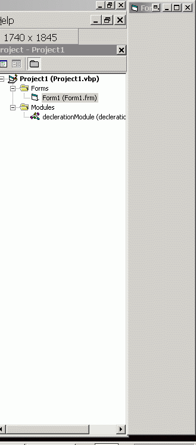

<div align="center">

## Snap Window to the Size of the Screen


</div>

### Description

This is a bug-fixed version of the code to snap a program to the sides of the screen, and keep it is a preserved space other programs see as a "dead zone", so other windows can't expand to.

this is extremely useful in some cases.

important notice. fixed from SKoW's original post at

http://www.planetsourcecode.com/vb/scripts/ShowCode.asp?txtCodeId=14562&amp;lngWId=1

(original credit reserved for SKoW)

another thing to notice about is the fact that the measurement of the screen is not 100% accurate in this version. you may use the better way to find out taskbar's height in the following code: http://www.planetsourcecode.com/vb/scripts/ShowCode.asp?txtCodeId=23892&amp;lngWId=1

I will look at any suggestions written in comments area, considering a better lining with the screen's borders.
 
### More Info
 


<span>             |<span>
---                |---
**Submitted On**   |
**By**             |[EladKarako](https://github.com/Planet-Source-Code/PSCIndex/blob/master/ByAuthor/eladkarako.md)
**Level**          |Advanced
**User Rating**    |5.0 (10 globes from 2 users)
**Compatibility**  |VB 5\.0, VB 6\.0
**Category**       |[Windows API Call/ Explanation](https://github.com/Planet-Source-Code/PSCIndex/blob/master/ByCategory/windows-api-call-explanation__1-39.md)
**World**          |[Visual Basic](https://github.com/Planet-Source-Code/PSCIndex/blob/master/ByWorld/visual-basic.md)
**Archive File**   |[](https://github.com/Planet-Source-Code/eladkarako-snap-window-to-the-size-of-the-screen__1-72109/archive/master.zip)

### API Declarations

```
'PUT IN A BLANK MODULE:
Private Declare Function SystemParametersInfo Lib "user32.dll" Alias "SystemParametersInfoA" (ByVal uAction As Long, ByVal uiParam As Long, pvParam As Any, ByVal fWinIni As Long) As Long
Public Enum DockTypes
  DockLeft = 1
  DockTop = 2
  DockRight = 3
  DockBottom = 4
End Enum
Public Type vbRECT ' use this To save old Window Positions
  vbLeft As Long
  vbTop As Long
  vbWidth As Long
  vbHeight As Long
End Type
Public Type RECT
  Left As Long
  Top As Long
  Right As Long
  Bottom As Long
End Type
Private Const SPIF_SENDWININICHANGE = &H2
Private Const SPI_GETWORKAREA = 48
Private Const SPI_SETWORKAREA = 47
Private vbFormOldRect As vbRECT
Private LastDock As DockTypes
Private DockAmount As Integer
Public Sub UnDockForm(ByRef vbForm As Form)
  Dim Desktop As RECT
  SystemParametersInfo SPI_GETWORKAREA, 0&, Desktop, 0&
  DoEvents
  With Desktop
    Select Case LastDock
      Case DockBottom
          .Bottom = .Bottom + DockAmount
      Case DockLeft
          .Left = .Left - DockAmount
      Case DockTop
          .Top = .Top - DockAmount
      Case DockRight
          .Right = .Right + DockAmount
      Case Else
          Exit Sub
    End Select
  End With
  vbForm.Move vbFormOldRect.vbLeft, vbFormOldRect.vbTop, vbFormOldRect.vbWidth, vbFormOldRect.vbHeight
  SystemParametersInfo SPI_SETWORKAREA, 0&, Desktop, SPIF_SENDWININICHANGE
  DoEvents
  LastDock = 0
End Sub
Public Sub DockForm(ByRef vbForm As Form, DockPos As DockTypes)
  If (LastDock &lt;&gt; 0) Then Call UnDockForm(vbForm)
  vbFormOldRect.vbHeight = vbForm.Height
  vbFormOldRect.vbLeft = vbForm.Left
  vbFormOldRect.vbTop = vbForm.Top
  vbFormOldRect.vbWidth = vbForm.Width
  Dim Desktop As RECT
  SystemParametersInfo SPI_GETWORKAREA, 0&, Desktop, 0&
  DoEvents
  Dim V As vbRECT
  V = vbFormOldRect
  Select Case DockPos
    Case DockLeft
        V.vbTop = (Desktop.Top * 15)
        V.vbLeft = (Desktop.Left * 15)
        V.vbHeight = (Desktop.Bottom * 15) - V.vbTop
    Case DockRight
        V.vbTop = (Desktop.Top * 15)
        V.vbLeft = (Desktop.Right * 15) - V.vbWidth
        V.vbHeight = (Desktop.Bottom * 15) - V.vbTop
    Case DockBottom
        V.vbTop = (Desktop.Bottom * 15) - V.vbHeight
        V.vbLeft = (Desktop.Left * 15)
        V.vbWidth = (Desktop.Right * 15) - V.vbLeft
    Case DockTop
        V.vbTop = (Desktop.Top * 15)
        V.vbLeft = (Desktop.Left * 15)
        V.vbWidth = (Desktop.Right * 15) - V.vbLeft
    Case Else
        Exit Sub
  End Select
  Select Case DockPos
    Case DockBottom
      DockAmount = (vbForm.Height / 15)
      Desktop.Bottom = Desktop.Bottom - DockAmount
    Case DockRight
      DockAmount = (vbForm.Width / 15)
      Desktop.Right = Desktop.Right - DockAmount
    Case DockTop
      DockAmount = (vbForm.Height / 15)
      Desktop.Top = Desktop.Top + DockAmount
    Case DockLeft
      DockAmount = (vbForm.Width / 15)
      Desktop.Left = Desktop.Left + DockAmount
  End Select
  SystemParametersInfo SPI_SETWORKAREA, 0&, Desktop, SPIF_SENDWININICHANGE
  DoEvents
  vbForm.Move V.vbLeft, V.vbTop, V.vbWidth, V.vbHeight
  LastDock = DockPos
End Sub
```


### Source Code

```
'TO USE IN YOU FORM (NO CONTROLS ADDING NEEDED)
Private Sub Form_Activate()
  DockForm Me, DockRight
End Sub
Private Sub Form_Terminate()
  UnDockForm Me
End Sub
```

